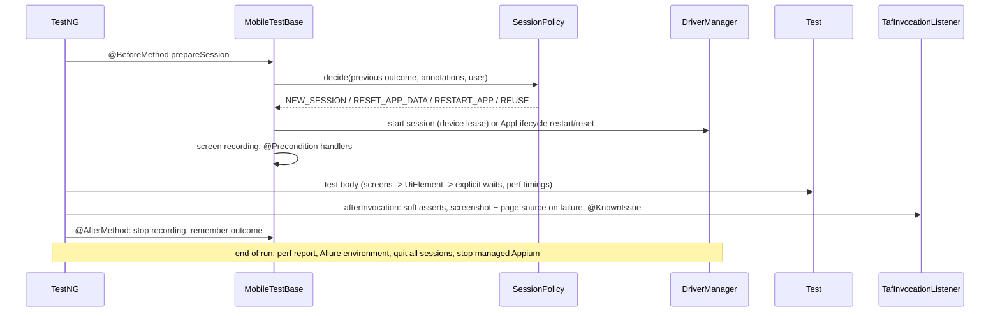

# Architecture

## Modules

| Module | Contains |
|---|---|
| `taf-core` | Framework: config, drivers, screen model, sessions, preconditions, mocking, perf, artifacts, TestNG/Allure integration. Unit-tested without devices (Mockito drivers, embedded WireMock). |
| `examples` | Screens, components, preconditions and tests for the demo app. Replace with your app. |

## Packages of `taf-core`

```
config/        TafConfig (layered config), RuntimeOverrides, SecretsGuard
driver/        Platform, OptionsBuilder (caps), DriverFactory (local/managed/cloud), CloudProvider,
               DevicePool + DeviceLease (parallel devices), DriverManager (session per thread)
screen/        Screen, Component, ScreenMixin, UiElement(s), ComponentList, ScreenFactory (injection),
               @Locate/@Using/How, @ScreenIdentifier, @WaitFor, LocatorResolver, Waits
gesture/       Gestures (W3C actions)
session/       StartMode, SessionPolicy, AppLifecycle, @FreshSession, @ResetAppData
users/         @TestUser, TestUsers, UserCredentials
precondition/  @Precondition (meta-annotation), PreconditionHandler, PreconditionRunner
mock/          MockServer (WireMock reverse/forward proxy)
perf/          PerfCollector, PerfStats, PerfReport
artifacts/     FailureArtifacts (screenshot, page source), ScreenRecorder
failure/       failure taxonomy
testng/        listeners, TestContext, @KnownIssue, @Quarantined, Groups, InfraRetryAnalyzer
verify/, log/, allure/, report/, lint/
MobileTestBase, MobileReports
```

## Test lifecycle



## Design decisions

- **Lazy, re-located elements.** A `UiElement` stores *how* to find an element, never a `WebElement`. Every action
  locates it again with an explicit wait, which avoids stale references, implicit-wait timing surprises and
  `Thread.sleep`.
- **Names everywhere.** Elements know `Screen.field[index]`, so failures, steps and perf rows are self-explanatory.
- **Composition over inheritance.** Shared UI is a `Component` plus a mixin interface, not a deep `BaseScreen` chain.
- **One session per thread, one thread per device.** `DriverManager` (ThreadLocal) and `DevicePool` (leases with
  per-device ports) make parallel runs safe by construction.
- **Cheapest safe start.** Restarting the app instead of the session keeps suites fast. A failure always earns a
  fresh session.
- **Evidence over logs.** Screenshot, page source and video are attached where the failure is, in the report.
